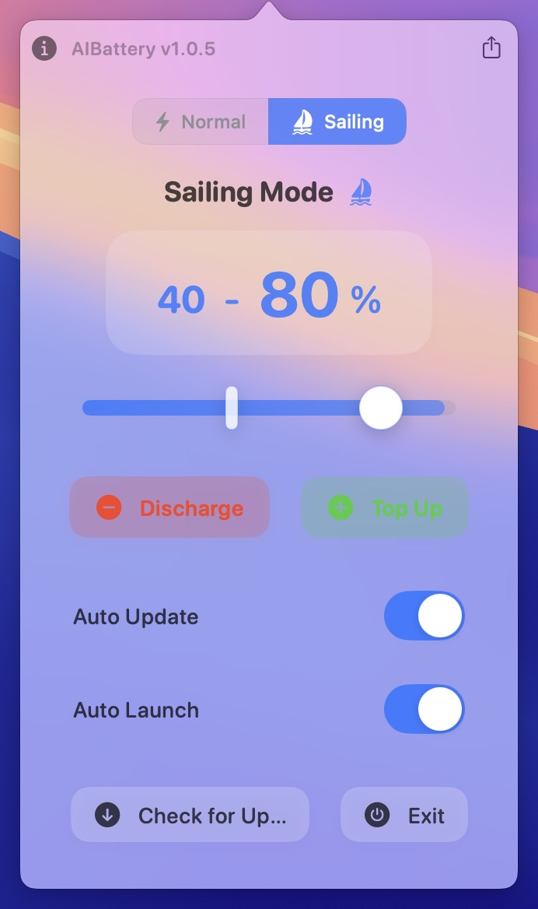

<h1 align="center">AIBattery</h1>
<h3 align="center">Smart Battery Management for macOS</h3>

  <strong>Extend your MacBook's battery lifespan with intelligent power management</strong>

  <a href="#-key-features">Features</a> •
  <a href="#-installation">Installation</a> •
  <a href="#-usage">Usage</a> •
  <a href="#-system-requirements">Requirements</a> •
  <a href="#-privacy">Privacy</a> •
    <a href="#%EF%B8%8F-disclaimer">Disclaimer</a> •
  <a href="#%EF%B8%8F-support">Support</a>

---

## ✨ Key Features

AIBattery intelligently manages your MacBook's battery to maximize its lifespan:

- **⚡ Set Charge Limits** — Prevent battery degradation by capping charge levels at your preferred threshold
- **🔋 Discharge Mode** — Run on battery power even when plugged in to maintain optimal battery chemistry
- **🔌 Top-Up Mode** — Override limits when you need a full charge before unplugging
- **🔄 Auto-Launch** — Set and forget with automatic startup on boot

## 📥 Installation

1. Download the latest version from the [Releases Page](https://github.com/whuan132/AIBattery/releases)
2. Open the `.dmg` file and drag **AIBattery** to your **Applications** folder
3. Launch AIBattery from your macOS menu bar

## 🚀 Usage

<table>
<tr>
<td width="60%">

### Quick Start Guide
1. **Access AIBattery** from the menu bar icon
2. **Set charge limits** between 60-90% for optimal battery health
3. **Enable Discharge Mode** when you're stationary and plugged in
4. **Configure auto-launch** for continuous protection

### Recommended Settings
| Usage Pattern | Recommended Charge Limit|
|---------------|--------------------------|
| Mostly Plugged In | 60-70% |
| Mixed Usage | 80% |
| Frequent Travel | 85-90% |

</td>
<td width="40%">
<picture>
  <source media="(prefers-color-scheme: dark)" srcset="screenshots/dark.jpg">
  <source media="(prefers-color-scheme: light)" srcset="screenshots/light.jpg">
  
</picture>
</td>
</tr>
</table>

## 🔄 Updates

AIBattery checks for updates automatically to ensure you always have the latest features and optimizations.

To manually check for updates:
1. Click the AIBattery menu bar icon
2. Select **Check for Updates**
3. Follow the prompts if a new version is available

## 💻 System Requirements

- **macOS**: 12 Monterey or later
- **Hardware**: Compatible with both Apple Silicon (M1/M2/M3) and Intel-based Macs

## 🔒 Privacy

AIBattery respects your privacy:

- No data collection or transmission
- All operations performed locally on your device
- No network access is required for core functionality
- Open-source codebase for complete transparency

## ⚠️ Disclaimer

AIBattery is provided "as is" without warranty of any kind. While designed to improve battery health, use at your own risk. The developers are not responsible for any damage that may result from using this application.

## 🛠️ Support

Need help? We're here for you:

- **[Report Issues](https://github.com/whuan132/AIBattery/issues)** on GitHub

---

  Made with ❤️ by the AIBattery Team

